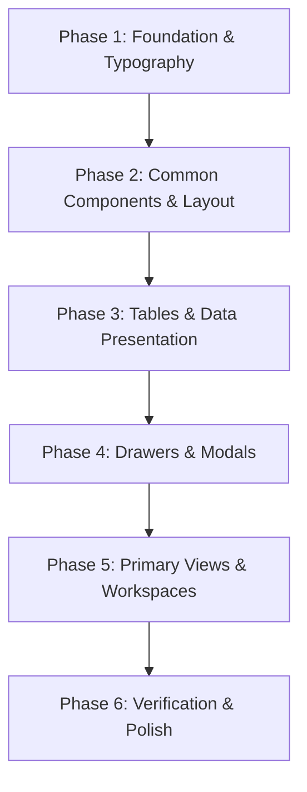

# Universal UI/UX Design System Audit & Step-by-Step Migration Plan

This document provides a comprehensive audit of the current Marine Assurance Platform (MAP v2) codebase against the mandatory design system specification (`@map-guidelines.md`), along with a phased, surgical roadmap to systematically align every component and view.

---

## Part 1: System-Wide Audit & Gap Analysis

| Category | Guideline Requirement | Current Status in Codebase | Action Required |
| :--- | :--- | :--- | :--- |
| **Typography** | `IBM Plex Sans` (Primary UI) + `IBM Plex Mono` (Tabular/IDs/Codes) | `IBM Plex Sans` and `IBM Plex Mono` configured. | 1. Use `.font-mono-code` for MAP IDs, IMOs, and tabular data. 2. **Card Numbers / Metrics**: Sized **3x larger** (`38px` - `44px`, Bold 700, IBM Plex Mono, `.map-kpi-value`) for clear visual prominence. |
| **Color Tokens** | Primary `#0B1B2B`, Hover `#1E3A5F`, Active `#08131F`, Focus Ring `#38BDF8` (2px offset) | Updated in `index.css`, but several legacy views and drawers contain arbitrary inline styles or hardcoded hex colors. | Systematically refactor views and drawers to use standard CSS tokens and remove inline style color overrides. |
| **Iconography** | Exclusive `lucide-react` icons. Standard sizing (16px, 18px, 20px, 32-48px). No icons on modal action buttons. | Mostly Lucide icons, but some components have inline SVGs. Modal action buttons need validation for icon-free text. | 1. Replace remaining inline SVGs with Lucide icons. 2. Enforce standard sizes (`w-4 h-4`, `w-[18px] h-[18px]`, `w-5 h-5`). 3. Remove icons from Cancel/Save/Create/Update modal buttons. |
| **Buttons & Controls** | 6px radius (`rounded-md`), compact padding (`px-3.5 py-2` or `px-2.5 py-1.5`). Pills only for badges. | Mixed button classes, some buttons use Tailwind defaults or inline heights/paddings. | Unify button classes with standardized padding, border radius, and calibrated interactive states. |
| **Layout & Grid** | Strict 4px/8px baseline spacing (`xs: 4px`, `sm: 8px`, `md: 16px`, `lg: 24px`, `xl: 32px`). Container gutters 24px/32px. | Occasional arbitrary margins and inline paddings in view cards and modal bodies. | Normalize spacing utilities to standard Tailwind grid tokens (`p-2`, `p-3`, `p-4`, `gap-2`, `gap-3`). |
| **Data Sourcing** | Zero inline hardcoded mock records in components. Strictly centralized stores and mock files. | Central stores exist (`useMapStore.ts`, `mockData.ts`, `crewMockData.ts`, etc.), but some views have local dummy fallback objects. | Ensure all views and tables consume mock records exclusively through store selectors and helper modules. |
| **UI/UX Heuristics** | NN/g heuristics: status visibility, clear breadcrumbs, safe dismissals, error prevention. | Strong base architecture, but some modals and drawers lack uniform keyboard esc handlers, focus rings, or feedback toasts. | Enhance modal accessibility, focus management, and unified toast notifications. |

---

## Part 2: Step-by-Step Phased Migration Roadmap

---

### Phase 1: Foundation & Core Token Alignment (Target: Global Assets) — [COMPLETED]
- [x] **1.1 Font Stack Update**:
  - Updated `index.html` to include `IBM Plex Mono` (400, 500, 600) alongside `IBM Plex Sans`.
  - Updated `src/index.css` typography variables (`--font-sans` and `--font-mono`).
- [x] **1.2 Global Utility Classes**:
  - Enforced typography utility rules (H1 24px/700, H2 18px/600, H3 16px/600, Body 14px/400, Labels/Headers 13px/500, Badges 12px/500, Mono IDs 13px/500).
  - Added standardized table and button token classes.

---

### Phase 2: Navigation & Structural Shell (Target: Layout Components) — [COMPLETED]
- [x] **2.1 Sidebar (`AppSidebar.tsx`)**:
  - Verified primary brand `#0B1B2B` background and active item styling.
  - Standardized Lucide icon usage (replaced raw string arrows with Lucide `ChevronDown`, `ChevronUp`, `LogOut`).
- [x] **2.2 Top Header (`HeaderBanner.tsx`)**:
  - Cleaned up inline styles, ensured typography tokens and responsive persona pill selector alignment.

---

### Phase 3: Core Tables & Tabular Data (Target: `src/components/tables/`) — [COMPLETED]
- [x] **3.1 `VesselTable.tsx`**:
  - Replaced inline SVGs and checkmarks with Lucide icons (`LayoutGrid`, `Table`, `Check`, `MoreHorizontal`).
  - Standardized action buttons (`px-2.5 py-1.5`) and status badge alignment.
- [x] **3.2 `AssuranceTable.tsx`**:
  - Formatted MAP assurance set IDs (`MAP-ASS-YYYY-...`) with `.font-mono-code`.
  - Standardized progress bars, readiness gauges, and status indicators.
- [x] **3.3 `CrewTable.tsx` & `DocumentTable.tsx` & `UserTable.tsx`**:
  - Replaced raw text pluses and sort arrows with Lucide sort indicators (`ArrowUpDown`, `ArrowUp`, `ArrowDown`).
  - Standardized clean button labels without ASCII symbols.

---

### Phase 4: Drawers & Modal Windows (Target: `src/components/drawers/`)
- [ ] **4.1 General Modal Standards**:
  - Remove icons from Cancel, Save, Create, and Update action buttons across all modals.
  - Implement uniform header styles (`bg-slate-900` / `#0B1B2B` with white title and Lucide `X` close button).
  - Remove all inline color overrides and extract component-scoped styles where necessary.
- [ ] **4.2 Priority Modals**:
  - `VesselModal.tsx`
  - `DocumentUploadModal.tsx` & `CrewDocumentUploadModal.tsx`
  - `InspectionDrawer.tsx`
  - `CapaReinspectionDrawer.tsx`
  - `AuditTrailDrawer.tsx` & `VersionHistoryDrawer.tsx`

---

### Phase 5: Primary Views & Workspaces (Target: `src/views/`)
- [ ] **5.1 Vessel Detail (`VesselDetailView.tsx`)**:
  - Standardize tab headers, hero banners, statistics badges, and photo galleries.
- [ ] **5.2 Assurance & Checklist Views**:
  - `AssuranceDetailView.tsx`, `CreateAssuranceSetView.tsx`, `InspectionChecklistView.tsx`.
- [ ] **5.3 Dashboards & Workspaces**:
  - `DashboardView.tsx`, `ApproverDashboardView.tsx`, `InspectorWorkspaceView.tsx`, `VerifierWorkspaceView.tsx`.
- [ ] **5.4 Registry & Management Views**:
  - `FleetRegistryView.tsx`, `CrewView.tsx`, `EquipmentView.tsx`, `UserManagementView.tsx`, `RolesAndPermissionsView.tsx`.

---

### Phase 6: Final Verification & Accessibility Polish
- [ ] **6.1 Accessibility & Focus Rings**:
  - Verify keyboard tab navigation and focus ring visibility (`rgb(56, 189, 248)` with 2px offset).
- [ ] **6.2 Production Build Verification**:
  - Run `npm run build` (`tsc && vite build`) to confirm zero lint, type, or styling regressions.
